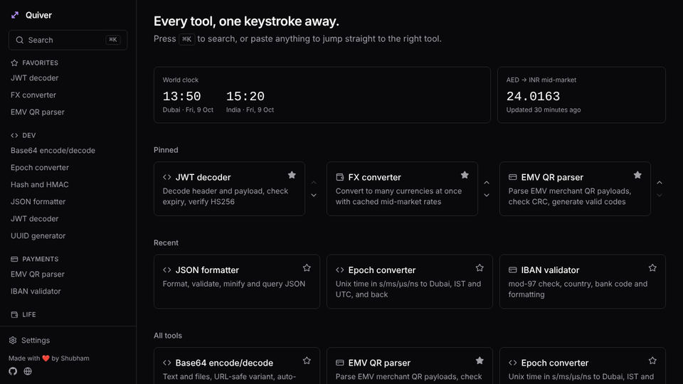
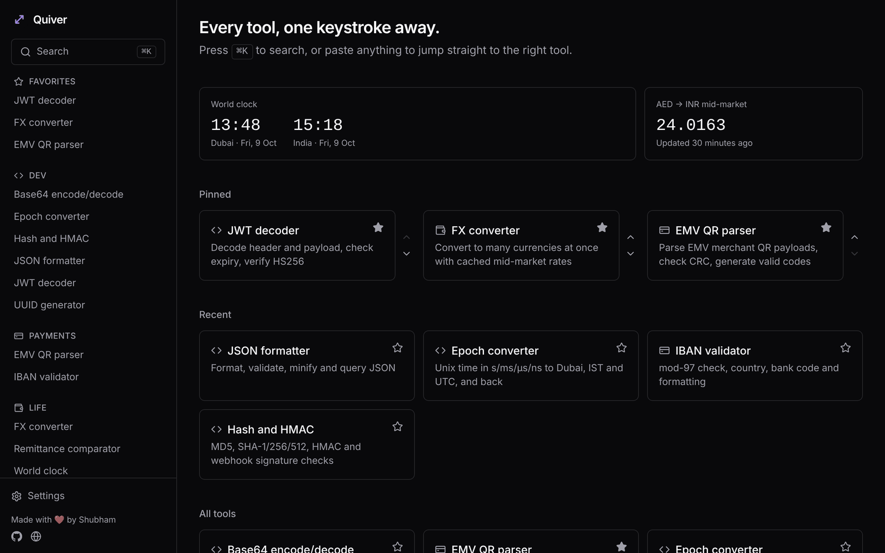
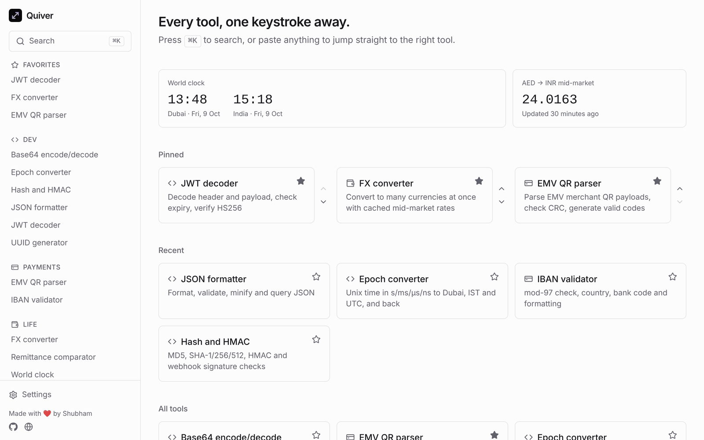
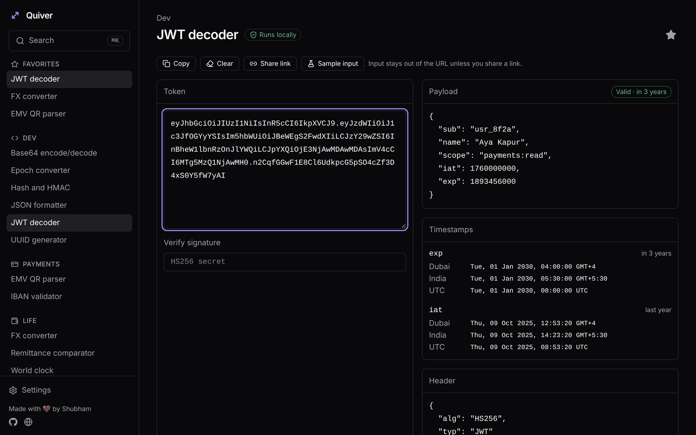
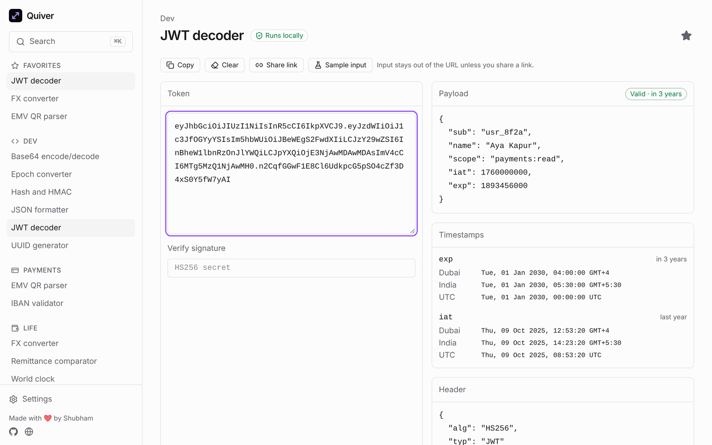
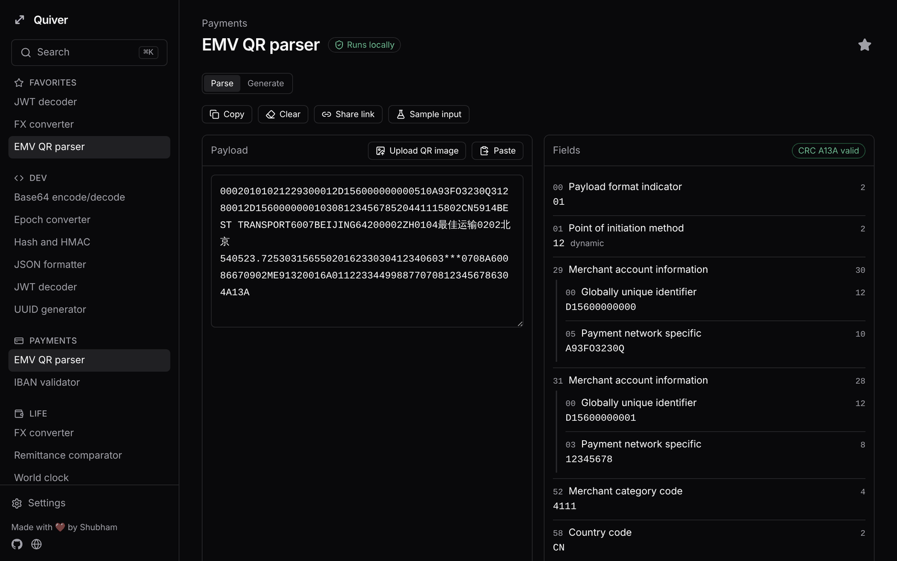
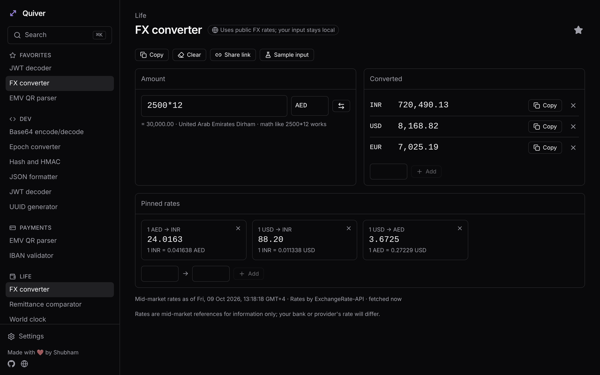
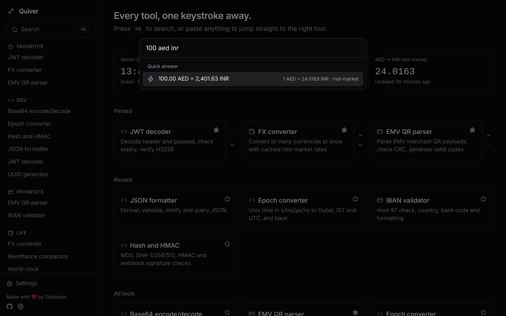
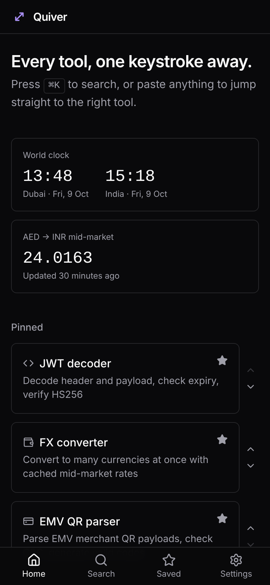

# Quiver

**Every tool, one keystroke away.** A private, offline toolbox for fintech engineers.

<!-- badges -->
[](https://github.com/shubhamnagota/quiver/actions/workflows/ci.yml)
[-100%20%2F%20100%20%2F%20100%20%2F%20100-brightgreen)](https://pagespeed.web.dev/analysis?url=https%3A%2F%2Fquiver.shubhamnagota.com%2F&form_factor=mobile)
[](#quality)
[](LICENSE)
<!-- /badges -->

**[Open Quiver →](https://quiver.shubhamnagota.com)** · by [Shubham](https://shubhamnagota.com)

Quiver puts JSON, JWTs, epochs, hashes, IBANs, EMV QR codes, FX and more behind one ⌘K command palette. It runs entirely in the browser: no backend, no account, no tracking. Tokens, payloads and keys never leave your device, and after the first visit it works offline.



| Dark | Light |
| --- | --- |
|  |  |
|  |  |

<details>
<summary>More screenshots</summary>

| | |
| --- | --- |
|  |  |
|  |  |

</details>

## Features

- **⌘K command palette** with ranked search over tool names and keywords; pinned and recent tools come first.
- **Paste to open**: paste a JWT, JSON, epoch or Base64 anywhere (or into the palette) and the right tool opens with it.
- **Quick answers** in the palette: type an epoch to see the date, `100 aed inr` to convert, or `uuid` to copy a fresh one.
- **Home widgets**: live world clock and the AED → INR mid-market rate.
- **Shareable links**: tool input lives in the URL, except for sensitive tools (JWT, hashes, scratchpad) unless you choose to share.
- **Pinned and recent tools** on the home screen, persisted locally.
- **Keyboard first**: ⌘K opens the palette, Esc goes back, ⌘C copies a tool's output. Arrow keys move through the sidebar, tool grids and toolbars (→/← hop between sidebar and page, Home/End jump to the ends), and switch options in toggle groups.
- **Installable and offline**: a PWA that precaches every tool, so everything except live FX rates works with no connection after the first visit.
- **Dark and light themes**, following the system by choice, with WCAG AA contrast in both (checked with axe-core).
- **Settings export/import** as JSON; nothing syncs anywhere.

## Tools

| Tool | What it does |
| --- | --- |
| JSON formatter | Pretty-print, minify, validate with line/column errors, tree view, JSONPath queries |
| JWT decoder | Header and payload, exp/iat/nbf in Dubai, IST and UTC, expiry badge, HS256/384/512 verification |
| Base64 | Text and files, URL-safe variant, auto-detects direction, downloads decoded binaries |
| Epoch converter | s/ms/µs/ns auto-detect, Dubai/IST/UTC side by side, relative time, date → epoch |
| Hash and HMAC | MD5, SHA-1/256/384/512, HMAC in hex or base64, webhook signature check |
| UUID generator | Bulk v4 UUIDs |
| EMV QR parser | Parse merchant-presented EMV QR payloads into a field tree, verify CRC16, generate valid codes as SVG. Upload, drop or paste a QR image (⌘V or the Paste button): it's decoded on the device (native `BarcodeDetector`, else [jsQR](https://github.com/cozmo/jsQR)) |
| IBAN validator | mod-97 check, country length rules, bank and branch codes, grouped formatting |
| FX converter | One amount to many currencies, math in the amount field, pinned rate pairs |
| Remittance comparator | Up to 4 provider quotes vs mid-market: amount received, effective rate, markup |
| World clock | Dubai and India by default, add any city, meeting planner with working-hours overlap |
| Text utilities | Case conversion, counts, dedupe, sort, trim, slugify |
| Scratchpad | Multiple Markdown pads with preview, autosaved in the browser |

More are on the way: JSON diff, cron explainer, regex tester, card BIN/Luhn, QR generator and others.

## Support

Quiver is free and has no ads or tracking. Donations are optional and never interrupt work: there's a "Support Quiver" link in the footer and a `/support` page (palette: "donate"), plus one dismissible thank-you after the 50th tool use. Methods are configured in `src/config.ts` (`SUPPORT`); anything left empty is hidden, and a unit test rejects any crypto address whose checksum doesn't match its network.

## Getting started

```sh
npm install
npm run dev
```

| Command | What it does |
| --- | --- |
| `npm run dev` | Start the dev server |
| `npm run build` | Typecheck and build static files into `dist/` |
| `npm run lint` | ESLint |
| `npm run typecheck` | TypeScript, strict |
| `npm test` | Vitest unit tests |
| `npm run coverage` | Tests with a coverage report in `coverage/` |
| `npm run badges` | Refresh the README badges from the latest coverage and Lighthouse results |

## Quality

The live site scores 100 in all four Lighthouse categories on [PageSpeed Insights](https://pagespeed.web.dev/analysis?url=https%3A%2F%2Fquiver.shubhamnagota.com%2F&form_factor=mobile) (mobile, slow 4G): first contentful paint 1.4 s, total blocking time 0 ms, layout shift 0.

Every push and pull request runs lint, strict typecheck, unit tests with coverage, a production build, and [Lighthouse CI](https://github.com/GoogleChrome/lighthouse-ci) on four pages (`lighthouserc.json`): accessibility, best practices and SEO must score 95 or higher or the build fails. Reports are attached to each run.

- Unit tests cover every tool's `lib.ts` with published test vectors where they exist (EMVCo CRC sample, EIP-55, BIP173/BIP350, standard MD5/SHA/HMAC vectors).
- Browser checks during development covered keyboard-only navigation, both themes at desktop and phone sizes with axe-core (no violations), offline use, and CSP violations (none).

## Deploying

`npm run build` produces a static site in `dist/`; no server or environment variables are needed. Production runs on Cloudflare Pages at [quiver.shubhamnagota.com](https://quiver.shubhamnagota.com):

1. Cloudflare dashboard → Workers & Pages → Create → Pages → Connect to Git → `shubhamnagota/quiver`.
2. Build command `npm run build`, output directory `dist`, environment variable `NODE_VERSION=22`.
3. After the first deploy: Custom domains → add `quiver.shubhamnagota.com` (Cloudflare creates the DNS record when the zone is on Cloudflare; otherwise add the CNAME it shows).

Pushes to `main` deploy to production and every pull request gets a preview URL. Headers (CSP, nosniff, caching) come from `public/_headers`, and Pages serves `index.html` for app routes. The same build also deploys to Vercel as is (`vercel.json`).

## Architecture

Quiver is a static single-page app built with Vite, React 19 and strict TypeScript, routed with TanStack Router and styled with Tailwind CSS. The palette is [cmdk](https://cmdk.paco.me), and settings persist to `localStorage` through Zustand.

Every tool is a self-contained folder under `src/tools/` that exports a manifest. The registry collects manifests with `import.meta.glob`, and the palette, sidebar, home and category pages are generated from it. Each tool's UI is lazy-loaded, so the shell stays small no matter how many tools exist.

```
src/
  components/   app shell: sidebar, bottom nav, command palette
  pages/        home, tool, category, saved, settings, about
  stores/       Zustand stores (preferences, palette)
  tools/
    registry.ts discovers every tools/*/manifest.ts
    types.ts    ToolManifest and categories
    json/       manifest.ts, lib.ts (+ tests), JsonTool.tsx
    …           one folder per tool
```

### FX rates

FX tools fetch USD-based mid-market rates from [ExchangeRate-API](https://www.exchangerate-api.com)'s open endpoint, falling back to [Frankfurter](https://frankfurter.dev) (ECB data, with AED derived from its USD peg of 3.6725), then to the last cached snapshot. Rates are cached in `localStorage` for 6 hours, shown immediately while refreshing in the background, and fetched at most once an hour. Every pair is computed locally from the USD base. No API keys are involved.

### Offline and install

[vite-plugin-pwa](https://vite-pwa-org.netlify.app) generates a Workbox service worker that precaches the shell and every tool chunk. New versions show an "Update available" prompt instead of swapping code under you. Chrome, Edge and Android offer an install button (sidebar and Settings); on iOS, Settings explains Share → Add to Home Screen.

### Security headers

`csp.ts` is the single source of truth for the Content Security Policy: no third-party scripts, no inline scripts except the theme bootstrap (allowed by its SHA-256 hash), and `connect-src` limited to the two FX hosts. Builds embed it as a meta tag; `public/_headers` (Cloudflare Pages, Netlify) and `vercel.json` send it as a header with `frame-ancestors 'none'`, and a unit test keeps all three in sync.

### Privacy model

Tools process input in the browser only. The only network calls are the keyless FX rate requests above, which send no user data; tools that make them declare `network: true` and say so in their badge, while every other tool shows a "Runs locally" badge. Tools marked `sensitive` keep their input out of the URL; sharing a link from one asks first. Markdown in the scratchpad is sanitised with DOMPurify before rendering.

## How to add a tool

1. Create `src/tools/<id>/`.
2. Put the pure logic in `lib.ts` and cover it with `lib.test.ts`.
3. Build the UI as a default-exported component, e.g. `MyTool.tsx`. Use `useToolInput('<id>')` for the main input (it handles paste handoff and URL state) and the shared `Panel`, `Split` and `ActionsBar` components from `src/components/tool/` so every tool looks and behaves the same.
4. Export a manifest from `manifest.ts`:

```ts
import type { ToolManifest } from '../types';

export default {
  id: 'my-tool',
  name: 'My tool',
  description: 'One line shown in the palette and on cards',
  category: 'dev',
  keywords: ['extra', 'search', 'terms'],
  detect: (input) => input.startsWith('my:'), // optional, powers paste-to-open
  component: () => import('./MyTool'),
} satisfies ToolManifest;
```

That's it: the tool appears in the palette, sidebar, home and its category page without touching shell code.

## License

MIT © Shubham
